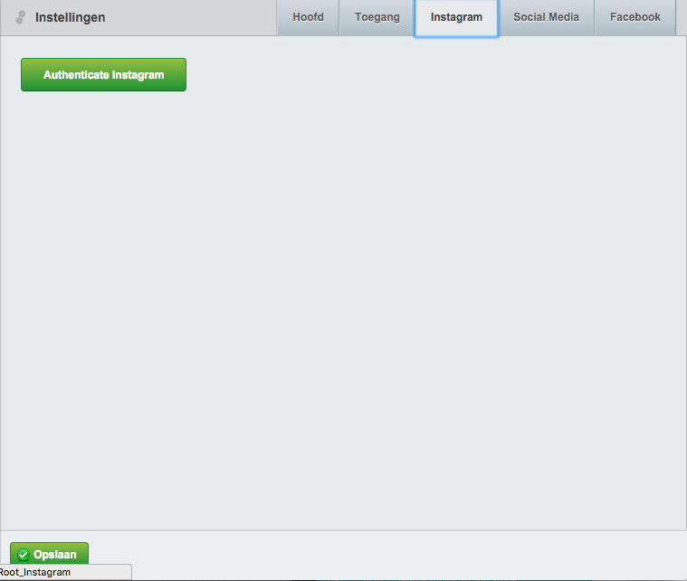
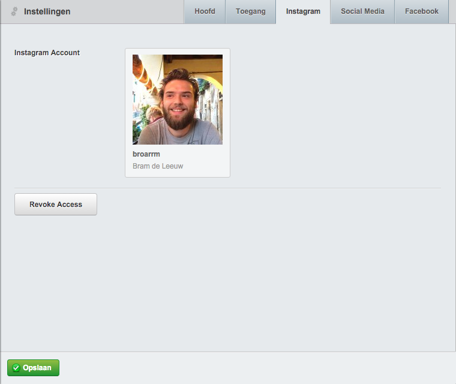

# Silverstripe Instagram

**Still in development**

Add instagram api support to you website! Creates a tab in the SiteConfig where content authors can add a client ID and Secret.
There will then be saved to the database after which the user can link there account trough a simple authentication button.





Some of the features are only available to non-sandbox clients.
By default, sandbox mode will only return the last 20 media items from authenticated users. 

To display the instagram media the following methods are available:
```php
/**
 * Get the latest media form the authenticated user
 * $limit defaults to 8
 */
Instagram::getCurrentUserMedia($limit);

/**
 * Get user media by given user name
 * In sandbox mode only authenticated user media will be shown, a non authenticated user name would return an empty array
 */
Instagram::getUserMedia($userName, $limit);

/**
 * Get media by tag name
 * In sandbox mode only authenticated user media will be shown, so use tags that are being used by the authenticated user
 */
Instagram::getTaggedMedia($tagName, $limit);
```